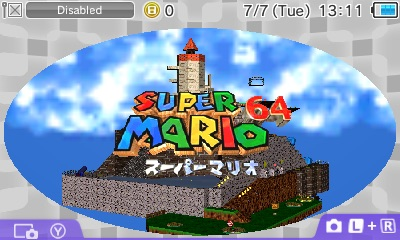

# Super Mario 64 3DS Port Ultimate / スーパーマリオ64 3DS ポート アルティメット

<p>
  
  
</p>

<table>
  <tr>
    <td width="50%" align="center" valign="top">
      <br>
      <sub>3D HOME Menu banner / 3D HOME メニューバナー</sub>
    </td>
    <td width="50%" align="center" valign="top">
      <br>
      <sub>Running on Nintendo 3DS / Nintendo 3DS 実機</sub>
    </td>
  </tr>
</table>

Super Mario 64 3DS Port Ultimate is a Nintendo 3DS-focused build of the SM64 decompilation port. It combines a bottom-screen minimap and HUD, improved camera controls, persistent display options, dynamic shadows, ragdoll effects, presentation upgrades, and optional debug tools.

Super Mario 64 3DS Port Ultimate は、SM64 デコンパイルポートを Nintendo 3DS 向けに拡張したビルドです。下画面ミニマップと HUD、改良されたカメラ操作、保存可能な表示設定、動的シャドウ、ラグドール、表示演出、任意のデバッグ機能を搭載しています。

## ⬇️ Download / ダウンロード

Clone without development screenshots:

開発中のスクリーンショットを除外してクローン：

```sh
git clone --filter=blob:none --sparse https://github.com/Epic0522/Super-Mario-64-3ds-port---Ultimate.git
cd Super-Mario-64-3ds-port---Ultimate
git sparse-checkout set --no-cone '/*' '!/indevscreenshots/'
```

## 🔗 Related Repositories / 関連リポジトリ

- [n64decomp/sm64](https://github.com/n64decomp/sm64) — SM64 decompilation / SM64 デコンパイル
- [sm64-port/sm64-port](https://github.com/sm64-port/sm64-port) — PC port lineage / PC ポート系統
- [sm64-port/sm64_3ds](https://github.com/sm64-port/sm64_3ds) — 3DS port lineage / 3DS ポート系統
- [mkst/sm64-port](https://github.com/mkst/sm64-port) — 3DS minimap prototype / 3DS ミニマッププロトタイプ

## ⚙️ Features / 機能

- **Bottom-screen interface:** course minimaps, Mario position and heading, lives, stars, coins, red coins, BGM titles, touch settings, and synchronized transitions.
  **下画面インターフェース：** コースマップ、マリオの位置と向き、残機、スター、コイン、赤コイン、BGM 名、タッチ設定、同期トランジションを表示します。
- **Camera and controls:** switch between the official camera and free Puppycam-style camera, with C-Stick input and quick recentering.
  **カメラと操作：** 公式カメラと Puppycam 風自由カメラを切り替え、C-Stick 操作とクイック再センタリングを利用できます。
- **3DS presentation:** stereoscopic 3D, 400px/800px modes, anti-aliasing options, a 3D HOME Menu banner, and persistent display settings.
  **3DS 表示演出：** 立体 3D、400px/800px モード、アンチエイリアス設定、3D HOME メニューバナー、保存可能な表示設定に対応します。
- **Gameplay enhancements:** optional dynamic shadows, death ragdoll, and hit ragdoll behavior.
  **ゲームプレイ拡張：** 動的シャドウ、死亡ラグドール、受撃ラグドールを任意で有効化できます。
- **Performance and audio:** 60 FPS support, multi-threaded audio, enhanced RSPA, and New 3DS-oriented rendering options. Luma3DS v10.1.1 or newer is required for multi-threaded audio.
  **パフォーマンスと音声：** 60 FPS、マルチスレッド音声、強化 RSPA、New 3DS 向け描画設定を搭載しています。マルチスレッド音声には Luma3DS v10.1.1 以降が必要です。
- **Debug tools:** an optional, non-persistent debug mode provides test shortcuts, FPS display support, and ragdoll utilities.
  **デバッグ機能：** 保存されない任意の debug モードで、テスト用ショートカット、FPS 表示、ラグドール確認機能を利用できます。

New 3DS is recommended. Typical targets are 40–60 FPS on New 3DS with enhanced effects enabled and 25–30 FPS on Old 3DS with lighter 400px settings.

New 3DS を推奨します。目安として、New 3DS では拡張効果有効時に 40～60 FPS、Old 3DS では軽量な 400px 設定で 25～30 FPS を想定しています。

## 🎮 Controls and Configuration / 操作と設定

Tap the lower screen to open the mini-menu. `X` switches cameras, `Y` recenters the view, and the C-Stick controls the free camera. The `Enh` page toggles dynamic shadows and ragdoll options.

下画面をタッチするとミニメニューが開きます。`X` でカメラ切り替え、`Y` で視点を再センタリングし、C-Stick で自由カメラを操作します。`Enh` ページでは動的シャドウとラグドール設定を変更できます。

`sm64config.txt` stores controls, Puppycam values, display mode, anti-aliasing, dynamic shadows, and ragdoll preferences. `.3dsx` builds keep configuration and save data beside the executable; `.cia` builds store them at the SD card root.

`sm64config.txt` には操作、Puppycam、表示モード、アンチエイリアス、動的シャドウ、ラグドール設定が保存されます。`.3dsx` 版は実行ファイルと同じ場所、`.cia` 版は SD カードのルートに設定とセーブデータを保存します。

When debug mode is enabled:

debug モード有効時：

| Shortcut / ショートカット | Function / 機能 |
| --- | --- |
| `SELECT + ZL + ZR` | Level selector / レベルセレクト |
| `START + ZL + ZR` in final Bowser fight | Ending and staff roll / エンディングとスタッフロール |
| Double-tap `ZR` | Trigger death ragdoll / 死亡ラグドールを起動 |
| Hold `ZR` | Restore health / 体力回復 |
| Double-tap `ZL` | Set low health / 体力を低下 |
| Hold `ZL` | In-place BLJ test / その場 BLJ テスト |

## 🏗️ Building / ビルド

Place the matching ROM in the repository root (`baserom.us.z64`, `baserom.eu.z64`, `baserom.jp.z64`, or `baserom.sh.z64`). The first `make` automatically builds host tools and extracts the required assets; running `extract_assets.py` manually is not required.

対応する ROM（`baserom.us.z64`、`baserom.eu.z64`、`baserom.jp.z64`、`baserom.sh.z64`）をリポジトリのルートに配置してください。最初の `make` がホストツールの作成と必要なアセット抽出を自動実行するため、通常は `extract_assets.py` を手動実行する必要はありません。

Requirements / 必要環境：

- devkitPro and devkitARM
- `3dsxtool`, `smdhtool`, `tex3ds`, and `makerom`
- `bannertool` for CIA builds / CIA ビルド用 `bannertool`

Example environment / 環境変数の例：

```sh
export DEVKITPRO=/opt/devkitpro
export DEVKITARM=/opt/devkitpro/devkitARM
export PATH="/opt/devkitpro/devkitARM/bin:/opt/devkitpro/tools/bin:$PATH"
```

Build `.3dsx` / `.3dsx` をビルド：

```sh
make VERSION=us -j$(sysctl -n hw.ncpu)
```

Build `.cia` / `.cia` をビルド：

```sh
BANNERTOOL=/path/to/bannertool make VERSION=us cia -j$(sysctl -n hw.ncpu)
```

Use `VERSION=eu`, `jp`, or `sh` for another region. Run `make clean` after changing build flags.

別リージョンでは `VERSION=eu`、`jp`、`sh` を指定します。ビルドフラグを変更した後は `make clean` を実行してください。

| Optional flag / 任意フラグ | Purpose / 用途 |
| --- | --- |
| `BANNER_MODE=static` | Use the legacy static CIA banner / 従来の静的 CIA バナーを使用 |
| `ENABLE_N3DS_FRAMESKIP=1` | Enable legacy frame skip / 旧フレームスキップを有効化 |
| `DISABLE_AUDIO=1` | Disable audio for testing / テスト用に音声を無効化 |
| `FORCE_REFERENCE_RSPA=1` | Use reference RSP audio / 参照 RSP 音声を使用 |
| `DISABLE_ENHANCED_RSPA=1` | Disable enhanced RSPA / 強化 RSPA を無効化 |
| `AUDIO_USE_ACCURATE_MATH=1` | Use accurate audio math / 高精度音声演算を使用 |

### Asset overrides / アセット上書き

Some extracted actor files have project-specific fixes mirrored under `project_asset_overrides/`. If you run asset extraction manually, restore them afterward:

一部の抽出済み actor ファイルには本プロジェクト固有の修正があり、`project_asset_overrides/` に複製されています。アセット抽出を手動実行した場合は、後から復元してください：

```sh
cp -R project_asset_overrides/* .
```

## 📦 Package Assets / パッケージ用アセット

`3ds/icon.png` is used for the `.3dsx` and CIA icon. CIA builds use the prebuilt 3D banner at `3ds/banner_3d/banner.bnr` by default; `BANNER_MODE=static` selects the legacy `3ds/banner.png` banner.

`3ds/icon.png` は `.3dsx` と CIA のアイコンに使われます。CIA は標準で `3ds/banner_3d/banner.bnr` のビルド済み 3D バナーを使用し、`BANNER_MODE=static` で従来の `3ds/banner.png` を選択できます。

Regenerate the 3D BNR after updating its CGFX or audio:

CGFX または音声を更新した後に 3D BNR を再生成：

```sh
BANNERTOOL=/path/to/bannertool
"$BANNERTOOL" makebanner -ci 3ds/banner_3d/banner.cgfx -a 3ds/audio.wav -o 3ds/banner_3d/banner.bnr
```

Banner authoring helpers are under `tools/banner_3d/`. Keep the CGFX below 512 KiB and validate final banners on real hardware.

バナー制作補助ツールは `tools/banner_3d/` にあります。CGFX は 512 KiB 未満に保ち、最終バナーは実機で確認してください。

## 🗺️ Minimap Tools / ミニマップツール

Internal scripts under `tools/` can regenerate collision drafts, textured drafts, and minimap text resources. Python 3 is required; text texture generation also requires Pillow.

`tools/` 内の内部スクリプトで、コリジョン下書き、テクスチャ付き下書き、ミニマップ文字素材を再生成できます。Python 3 が必要で、文字テクスチャ生成には Pillow も必要です。

```sh
python3 -m pip install pillow
python3 tools/minimap_extract_collision.py --level bob --area 1 --grid --fit
python3 tools/minimap_extract_textured.py --level bob --area 1 --compose-map
python3 tools/generate_minimap_title_textures.py
python3 tools/generate_minimap_music_textures.py
```

Updated `src/minimap/textures/*.png` files are converted automatically during the normal 3DS build.

更新した `src/minimap/textures/*.png` は通常の 3DS ビルド時に自動変換されます。

## 🌲 Project Structure / プロジェクト構成

The repository follows the standard SM64 decompilation layout. Most project-specific game and renderer changes live under `enhancements/`, `src/`, and `include/`; 3DS package assets live under `3ds/`, and build or asset helpers live under `tools/`.

本リポジトリは標準的な SM64 デコンパイル構成に従っています。プロジェクト固有のゲーム・描画変更は主に `enhancements/`、`src/`、`include/`、3DS パッケージ素材は `3ds/`、ビルド・アセット補助ツールは `tools/` にあります。

## 🫡 Credits / クレジット

This project builds on the work of the SM64 decompilation and port communities, including Gericom's `sm64_3ds` lineage and the Refresh 11-era 3DS improvements.

本プロジェクトは、Gericom の `sm64_3ds` 系統および Refresh 11 時期の 3DS 改善を含む、SM64 デコンパイル・ポートコミュニティの成果を基盤としています。

Minimap resources include work by alecpike (Bob-omb Battlefield), Turtle Boy (Lethal Lava Land and Whomp's Fortress), SlyP54 (Castle Grounds), Bruz (Castle Interior), and SM64DS minimaps documented by Mario Wiki.

ミニマップ素材については、alecpike（Bob-omb Battlefield）、Turtle Boy（Lethal Lava Land、Whomp's Fortress）、SlyP54（Castle Grounds）、Bruz（Castle Interior）、Mario Wiki 掲載の SM64DS ミニマップ素材に感謝します。

This is an unofficial fan project. Super Mario 64 and related assets are owned by Nintendo.

これは非公式のファンプロジェクトです。『スーパーマリオ64』および関連するキャラクター、商標、アセットは任天堂に帰属します。
